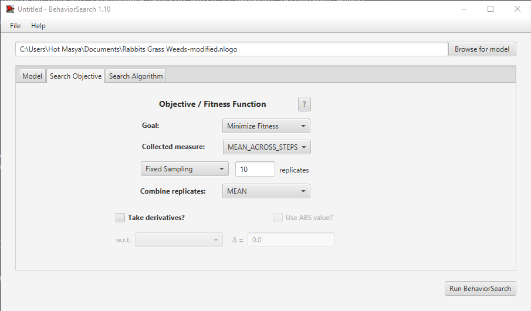

# Комп'ютерні системи імітаційного моделювання
### Виконав студент групи СПм-23-5 Дяченко Максим Сергійович
### Лабораторна робота №2. Редагування імітаційних моделей у середовищі NetLogo"

### Варіант 6, модель у середовищі NetLogo

[Rabbits Grass Weeds](https://www.netlogoweb.org/launch#https://www.netlogoweb.org/assets/modelslib/Sample%20Models/Biology/Rabbits%20Grass%20Weeds.nlogo) - моделювання екосистеми, що складається з кроликів, трави і бур'янів

#### Вербальний опис моделі

Цей проект досліджує просту екосистему, що складається з кроликів, трави та бур'янів. Кролики блукають довкола випадковим чином, а трава і бур'яни ростуть випадковим чином. Коли кролик натрапляє на траву або бур'яни, він їсть траву і отримує енергію. Якщо кролик отримує достатньо енергії, він розмножується. Якщо енергії не вистачає, він помирає. Також бур'яни можуть отруювати кроликів, через що ті не можуть певний час рухатись, розмножуватись та їсти.

#### Керуючі параметри

- `number` - початкова кількість кроликів;
- `poison-probability` - показник, що відповідає за вірогідність отруїтись бур'яном;
- `birth-threshold` - поріг енергії, при якому кролики розмножуються;
- `grass-grow-rate` - швидкість росту трави;
- `grass-energy` - кількість енергії, яку дає трава кролику, котрий її з'їдає;
- `weeds-grow-rate` - швидкість росту бур'янів;
- `weed-energy` - кількість енергії, яку дає бур'ян кролику, котрий його з'їдає;

#### Внутрішні параметри

- `pcolor` - змінна для кольорів патчів, щоб візуалізувати ріст трави (зелений патч) та бур'янів (фіолетовий патч)
- `energy` - поточна кількість енергії кролика
- `gender` - стать кролика - `male` або `female`
- `sick` - флаг, яким помічаються хворі кролики
- `ticks-sick` - кількість тактів, протягом яких пролик був хворим

#### Показники роботи моделі

- `grass` - кількість трави, що виросла в певний момент часу
- `rabbits` - кількість живих кроликів в певний момент часу
- `weeds` - кількість бур'янів в певний момент часу

### Налаштування середовища BehaviorSearch:
Обрана модель (модифікована, починаючи з лабораторної роботи №2):

```
C:\Users\Hot Masya\Documents\Rabbits Grass Weeds-modified.nlogo
```

#### Параметри моделі (вкладка Model):

Параметри та їх модливі діапазони були автоматично вилучені середовищем BehaviorSearch із вибраної імітаційної моделі, для цього є кнопка «Завантажити діапазони параметрів із інтерфейсу моделі», при цьому значення шагу для параметра `poison-probability` було змінено з 1 до 5, оскільки 1 - це занадто мале значення, яке не матиме впливу на модель.

```
["number" 50]
["grass-grow-rate" [0 1 20]]
["weeds-grow-rate" [0 1 20]]
["grass-energy" [0 0.5 10]]
["weed-energy" [0 0.5 10]]
["birth-threshold" [0 1 20]]
["poison-probability" [0 5 100]]
```

Для фітнес-функції було обрано значення популяції кроликів, вираз для її розрахунку взято з налаштувань графіка аналізованої імітаційної моделі в середовищі NetLogo:


та вказано у параметрі "Measure":

```
(count patches with [pcolor = green] / 4 ) / (count rabbits + 1)
```

Загальний вигляд вкладки налаштувань параметрів моделі:


### Налаштування цільової функції (вкладка Search Objective):

Метою підбору параметрів імітаційної моделі, що описує екосистему, що складається з кроликів, трави та бур'янів є гармонія, тобто баланс між ростом популяції кроликів та ростом трави – це вказано через параметр "Goal" зі значенням Minimize Fitness - тобто зменшити співвідношення кроликів та трави. Тобто необхідно визначити такі параметри налаштувань моделі, за яких на карті постійно будуть знаходитись як кролики, так і трава, в приблизно однаковій кількості. При цьому нас цікавить не просто середнє співвідношення популяції кроликів до кількості трави в якийсь окремий момент симуляції, а співвідношення протягом всієї симуляції, тобто параметр `Collected measure` дорівнюватиме `MEAN_ACROSS_STEPS`. Щоб уникнути викривлення результатів через випадкові значення, що використовуються в логіці самої імітаційної моделі, кожна симуляція повторюється по 10 разів, результуюче значення розраховується як середнє арифметичне.

Загальний вигляд вкладки налаштувань цільової функції:



Загальний вид вкладки налаштувань алгоритму пошуку:


### Результати використання BehaviorSearch:

Діалогове вікно запуску пошуку


Результат пошуку параметрів імітаційної моделі, використовуючи генетичний алгоритм:


Результат пошуку параметрів імітаційної моделі, використовуючи випадковий пошук:


